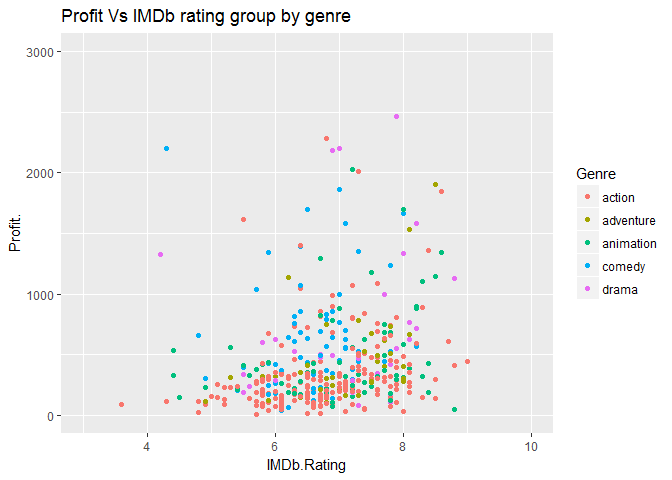

```r
getwd()
```

```
## [1] "C:/Users/Anusha Munnolli/Documents/R Programming Files/R MarkDown Files"
```

```r
setwd("C:\\Users\\Anusha Munnolli\\Documents\\R Programming Files")
movies<- read.csv("Section6-Homework-Data.csv")

head(movies)
```

```
##   Day.of.Week                Director  Genre       Movie.Title
## 1      Friday               Brad Bird action      Tomorrowland
## 2      Friday             Scott Waugh action    Need for Speed
## 3      Friday          Patrick Hughes action The Expendables 3
## 4      Friday Phil Lord, Chris Miller comedy    21 Jump Street
## 5      Friday         Roland Emmerich action  White House Down
## 6      Friday              David Ayer action              Fury
##   Release.Date              Studio Adjusted.Gross...mill. Budget...mill.
## 1   22/05/2015 Buena Vista Studios                  202.1            170
## 2   14/03/2014 Buena Vista Studios                  204.2             66
## 3   15/08/2014           Lionsgate                  207.1            100
## 4   16/03/2012                Sony                  208.8             42
## 5   28/06/2013                Sony                  209.7            150
## 6   17/10/2014                Sony                  212.8             80
##   Gross...mill. IMDb.Rating MovieLens.Rating Overseas...mill. Overseas.
## 1         202.1         6.7             3.26            111.9      55.4
## 2         203.3         6.6             2.97            159.7      78.6
## 3         206.2         6.1             2.93            166.9      80.9
## 4         201.6         7.2             3.62             63.1      31.3
## 5         205.4         8.0             3.65            132.3      64.4
## 6         211.8         5.8             2.85              126      59.5
##   Profit...mill. Profit. Runtime..min. US...mill. Gross...US
## 1           32.1    18.9           130       90.2       44.6
## 2          137.3   208.0           132       43.6       21.4
## 3          106.2   106.2           126       39.3       19.1
## 4          159.6   380.0           109      138.4       68.7
## 5           55.4    36.9           131       73.1       35.6
## 6          131.8   164.8           134       85.8       40.5
```

```r
str(movies)
```

```
## 'data.frame':	608 obs. of  18 variables:
##  $ Day.of.Week           : Factor w/ 6 levels "Friday","Saturday",..: 1 1 1 1 1 1 4 1 1 1 ...
##  $ Director              : Factor w/ 337 levels "Aaron Blaise, Robert A. Walker",..: 31 297 233 256 287 76 276 71 108 126 ...
##  $ Genre                 : Factor w/ 15 levels "action","adventure",..: 1 1 1 5 1 1 2 1 1 10 ...
##  $ Movie.Title           : Factor w/ 608 levels "10,000 B.C.",..: 557 314 466 6 592 161 233 378 128 331 ...
##  $ Release.Date          : Factor w/ 534 levels "1/05/2009","1/05/2015",..: 273 86 121 134 384 159 347 16 28 257 ...
##  $ Studio                : Factor w/ 36 levels "Art House Studios",..: 2 2 11 25 25 25 2 31 31 20 ...
##  $ Adjusted.Gross...mill.: Factor w/ 585 levels "1,003","1,020",..: 50 51 52 53 54 55 56 57 58 59 ...
##  $ Budget...mill.        : num  170 66 100 42 150 80 50 85 70 5 ...
##  $ Gross...mill.         : Factor w/ 561 levels "1,004.60","1,017",..: 30 33 43 27 40 59 63 49 72 45 ...
##  $ IMDb.Rating           : num  6.7 6.6 6.1 7.2 8 5.8 6 6.8 6.3 5.9 ...
##  $ MovieLens.Rating      : num  3.26 2.97 2.93 3.62 3.65 2.85 3.16 3.45 2.92 2.9 ...
##  $ Overseas...mill.      : Factor w/ 551 levels "1,160.60","1,528.10",..: 32 151 172 490 82 66 528 523 150 11 ...
##  $ Overseas.             : num  55.4 78.6 80.9 31.3 64.4 59.5 39.9 39.3 73.9 49.8 ...
##  $ Profit...mill.        : Factor w/ 566 levels "1,015.40","1,025.90",..: 366 47 13 94 494 39 100 28 69 189 ...
##  $ Profit.               : num  18.9 208 106.2 380 36.9 ...
##  $ Runtime..min.         : int  130 132 126 109 131 134 125 115 92 84 ...
##  $ US...mill.            : num  90.2 43.6 39.3 138.4 73.1 ...
##  $ Gross...US            : num  44.6 21.4 19.1 68.7 35.6 40.5 60.1 60.7 26.1 50.2 ...
```

```r
summary(movies)
```

```
##     Day.of.Week              Director         Genre    
##  Friday   :448   Steven Spielberg: 19   action   :236  
##  Saturday :  3   Robert Zemeckis :  9   animation: 97  
##  Sunday   :  1   Michael Bay     :  8   comedy   : 91  
##  Thursday : 27   Peter Jackson   :  7   drama    : 52  
##  Tuesday  : 10   Ridley Scott    :  7   adventure: 50  
##  Wednesday:119   Tim Burton      :  7   sci-fi   : 16  
##                  (Other)         :551   (Other)  : 66  
##                 Movie.Title      Release.Date                 Studio   
##  10,000 B.C.          :  1   25/12/2008:  4   Buena Vista Studios: 93  
##  101 Dalmatians       :  1   1/07/2009 :  3   WB                 : 93  
##  101 Dalmatians (1996):  1   16/12/2011:  3   Fox                : 85  
##  2 Fast 2 Furious     :  1   19/11/1999:  3   Universal          : 79  
##  2012                 :  1   1/05/2009 :  2   Sony               : 65  
##  21 Jump Street       :  1   10/06/2005:  2   Paramount Pictures : 62  
##  (Other)              :602   (Other)   :591   (Other)            :131  
##  Adjusted.Gross...mill. Budget...mill.   Gross...mill.  IMDb.Rating   
##  296    :  3            Min.   :  0.60   202    :  3   Min.   :3.600  
##  231    :  2            1st Qu.: 45.00   211.8  :  3   1st Qu.:6.375  
##  269.4  :  2            Median : 80.00   214    :  3   Median :6.900  
##  274    :  2            Mean   : 92.47   215.9  :  3   Mean   :6.924  
##  280    :  2            3rd Qu.:130.00   245.7  :  3   3rd Qu.:7.600  
##  294.3  :  2            Max.   :300.00   201.6  :  2   Max.   :9.200  
##  (Other):595                             (Other):591                  
##  MovieLens.Rating Overseas...mill.   Overseas.     Profit...mill.
##  Min.   :1.490    106    :  3      Min.   : 17.2   180.7  :  3   
##  1st Qu.:3.038    111.9  :  3      1st Qu.: 49.9   245.7  :  3   
##  Median :3.365    140    :  3      Median : 58.2   127.5  :  2   
##  Mean   :3.340    150    :  3      Mean   : 57.7   140.7  :  2   
##  3rd Qu.:3.672    193    :  3      3rd Qu.: 66.3   168.4  :  2   
##  Max.   :4.500    338.7  :  3      Max.   :100.0   182.7  :  2   
##                   (Other):590                      (Other):594   
##     Profit.        Runtime..min.     US...mill.      Gross...US  
##  Min.   :    7.7   Min.   : 30.0   Min.   :  0.0   Min.   : 0.0  
##  1st Qu.:  201.8   1st Qu.:100.0   1st Qu.:107.0   1st Qu.:33.7  
##  Median :  338.6   Median :116.0   Median :141.7   Median :41.8  
##  Mean   :  719.3   Mean   :117.8   Mean   :167.1   Mean   :42.3  
##  3rd Qu.:  650.1   3rd Qu.:130.2   3rd Qu.:202.1   3rd Qu.:50.1  
##  Max.   :41333.3   Max.   :238.0   Max.   :760.5   Max.   :82.8  
## 
```

```r
levels(movies$Studio)
```

```
##  [1] "Art House Studios"        "Buena Vista Studios"     
##  [3] "Colombia Pictures"        "Dimension Films"         
##  [5] "Disney"                   "DreamWorks"              
##  [7] "Fox"                      "Fox Searchlight Pictures"
##  [9] "Gramercy Pictures"        "IFC"                     
## [11] "Lionsgate"                "Lionsgate Films"         
## [13] "Lionsgate/Summit"         "MGM"                     
## [15] "MiraMax"                  "New Line Cinema"         
## [17] "New Market Films"         "Orion"                   
## [19] "Pacific Data/DreamWorks"  "Paramount Pictures"      
## [21] "Path_ Distribution"       "Relativity Media"        
## [23] "Revolution Studios"       "Screen Gems"             
## [25] "Sony"                     "Sony Picture Classics"   
## [27] "StudioCanal"              "Summit Entertainment"    
## [29] "TriStar"                  "UA Entertainment"        
## [31] "Universal"                "USA"                     
## [33] "Vestron Pictures"         "WB"                      
## [35] "WB/New Line"              "Weinstein Company"
```

```r
levels(movies$Genre)
```

```
##  [1] "action"      "adventure"   "animation"   "biography"   "comedy"     
##  [6] "crime"       "documentary" "drama"       "fantasy"     "horror"     
## [11] "musical"     "mystery"     "romance"     "sci-fi"      "thriller"
```


```r
a<- movies[(movies$Studio== "Buena Vista Studios" | movies$Studio== "Fox" |
           movies$Studio== "Paramount Pictures" | movies$Studio== "Sony" |
             movies$Studio== "Universal" | movies$Studio== "WB") & 
             (movies$Genre=="action" | movies$Genre=="adventure" | 
                movies$Genre=="animation" | movies$Genre=="comedy" |
                movies$Genre=="drama"),] 
head(a)
```

```
##   Day.of.Week                Director     Genre      Movie.Title
## 1      Friday               Brad Bird    action     Tomorrowland
## 2      Friday             Scott Waugh    action   Need for Speed
## 4      Friday Phil Lord, Chris Miller    comedy   21 Jump Street
## 5      Friday         Roland Emmerich    action White House Down
## 6      Friday              David Ayer    action             Fury
## 7    Thursday            Rob Marshall adventure   Into the Woods
##   Release.Date              Studio Adjusted.Gross...mill. Budget...mill.
## 1   22/05/2015 Buena Vista Studios                  202.1            170
## 2   14/03/2014 Buena Vista Studios                  204.2             66
## 4   16/03/2012                Sony                  208.8             42
## 5   28/06/2013                Sony                  209.7            150
## 6   17/10/2014                Sony                  212.8             80
## 7   25/12/2014 Buena Vista Studios                  213.9             50
##   Gross...mill. IMDb.Rating MovieLens.Rating Overseas...mill. Overseas.
## 1         202.1         6.7             3.26            111.9      55.4
## 2         203.3         6.6             2.97            159.7      78.6
## 4         201.6         7.2             3.62             63.1      31.3
## 5         205.4         8.0             3.65            132.3      64.4
## 6         211.8         5.8             2.85              126      59.5
## 7         212.9         6.0             3.16             84.9      39.9
##   Profit...mill. Profit. Runtime..min. US...mill. Gross...US
## 1           32.1    18.9           130       90.2       44.6
## 2          137.3   208.0           132       43.6       21.4
## 4          159.6   380.0           109      138.4       68.7
## 5           55.4    36.9           131       73.1       35.6
## 6          131.8   164.8           134       85.8       40.5
## 7          162.9   325.8           125      128.0       60.1
```

```r
str(a)
```

```
## 'data.frame':	423 obs. of  18 variables:
##  $ Day.of.Week           : Factor w/ 6 levels "Friday","Saturday",..: 1 1 1 1 1 4 1 1 1 1 ...
##  $ Director              : Factor w/ 337 levels "Aaron Blaise, Robert A. Walker",..: 31 297 256 287 76 276 71 108 95 292 ...
##  $ Genre                 : Factor w/ 15 levels "action","adventure",..: 1 1 5 1 1 2 1 1 3 8 ...
##  $ Movie.Title           : Factor w/ 608 levels "10,000 B.C.",..: 557 314 6 592 161 233 378 128 607 132 ...
##  $ Release.Date          : Factor w/ 534 levels "1/05/2009","1/05/2015",..: 273 86 134 384 159 347 16 28 167 74 ...
##  $ Studio                : Factor w/ 36 levels "Art House Studios",..: 2 2 25 25 25 2 31 31 34 25 ...
##  $ Adjusted.Gross...mill.: Factor w/ 585 levels "1,003","1,020",..: 50 51 53 54 55 56 57 58 60 64 ...
##  $ Budget...mill.        : num  170 66 42 150 80 50 85 70 80 60 ...
##  $ Gross...mill.         : Factor w/ 561 levels "1,004.60","1,017",..: 30 33 27 40 59 63 49 72 27 36 ...
##  $ IMDb.Rating           : num  6.7 6.6 7.2 8 5.8 6 6.8 6.3 4.5 5.6 ...
##  $ MovieLens.Rating      : num  3.26 2.97 3.62 3.65 2.85 3.16 3.45 2.92 2.17 2.84 ...
##  $ Overseas...mill.      : Factor w/ 551 levels "1,160.60","1,528.10",..: 32 151 490 82 66 528 523 150 6 61 ...
##  $ Overseas.             : num  55.4 78.6 31.3 64.4 59.5 39.9 39.3 73.9 50.3 60.6 ...
##  $ Profit...mill.        : Factor w/ 566 levels "1,015.40","1,025.90",..: 366 47 94 494 39 100 28 69 26 66 ...
##  $ Profit.               : num  18.9 208 380 36.9 164.8 ...
##  $ Runtime..min.         : int  130 132 109 131 134 125 115 92 80 133 ...
##  $ US...mill.            : num  90.2 43.6 138.4 73.1 85.8 ...
##  $ Gross...US            : num  44.6 21.4 68.7 35.6 40.5 60.1 60.7 26.1 49.7 39.4 ...
```


```r
library(ggplot2)
```

```
## Warning: package 'ggplot2' was built under R version 3.4.1
```

```r
b<- ggplot (data= a, aes(x= Genre, y= Gross...US))
b+ geom_jitter(aes(color= Studio, size=Budget...mill.)) +
  geom_boxplot(alpha =0.5, outlier.color = NA) + 
  ggtitle("Domestic Gross % by Genre") +
  xlab("Genre") +
  ylab("Gross % US") +
  theme(axis.title.x = element_text(size= 20, color= "Blue", family = "serif"),
        axis.title.y = element_text(size= 20, color= "Blue", family = "serif"),
        axis.text = element_text( size =15, color ="Red", family ="serif"),
        plot.title = element_text(size = 25, family= "serif"),
        legend.title = element_text(size=15, family= "serif"),
        legend.text = element_text(size=10, family= "serif"))
```

<!-- -->

```r
qplot(data=a, x= IMDb.Rating, y= Profit.,color= Genre) + xlim(3,10) + ylim(0, 3000) +
  ggtitle("Profit Vs IMDb rating group by genre")
```

```
## Warning: Removed 6 rows containing missing values (geom_point).
```

<!-- -->

```r
qplot(data= a, x= Genre, fill= Genre) + ggtitle("Number of movies in each genre")
```

<!-- -->

```r
ggplot (data=a, aes(x = Gross...US, fill= Genre)) + geom_histogram(binwidth = 1)+
  ggtitle("Number of movies Vs Gross grouped by genre") + xlab("Gross in Millions (US)") + 
  ylab("Number of movies")
```

<!-- -->
